# CostForecast AI — Arquitectura AWS

> **Nota**: Este documento es parte de la prueba técnica DataKnow.
> La infraestructura está diseñada para producción pero **no está desplegada**.

---

## Diagrama de arquitectura

```mermaid
flowchart TD
    %% ── Actores externos ────────────────────────────────────────────────
    USR(["👤 Usuario\nNavegador"])
    ANTHROPIC(["🧠 Anthropic\nClaude API"])
    TAVILY(["🔍 Tavily\nSearch API"])

    %% ── Edge services ───────────────────────────────────────────────────
    subgraph EDGE["🌐 Edge / Acceso público"]
        CF["CloudFront\n(CDN + WAF)"]
        APIGW["API Gateway\n(REST)"]
    end

    %% ── Cómputo ─────────────────────────────────────────────────────────
    subgraph VPC["☁️ AWS VPC  (us-east-1)"]
        direction TB

        subgraph PUB["Subred pública"]
            ALB["Application\nLoad Balancer"]
        end

        subgraph PRIV["Subred privada"]
            direction LR

            subgraph APP["Capa de Aplicación  (ECS Fargate)"]
                STREAMLIT["📊 Streamlit\nPort 8501"]
                FASTAPI["⚡ FastAPI\nPort 8000"]
            end

            subgraph AGENT_LAYER["Capa de Agente  (Lambda)"]
                AGENT["🤖 LangGraph\nReAct Agent"]
            end

            subgraph ML_LAYER["Capa ML  (SageMaker Endpoints)"]
                SM_SAR["SARIMAX\n(1,1,1)"]
                SM_PRO["Prophet\n(yearly)"]
                SM_XGB["XGBoost\n(n=500)"]
            end
        end
    end

    %% ── Datos ───────────────────────────────────────────────────────────
    subgraph DATA["💾 Capa de Datos  (S3 + SageMaker)"]
        direction LR
        S3R["S3\n/raw  CSVs"]
        S3P["S3\n/processed  Parquet"]
        S3M["S3\n/models  Artifacts"]
        S3F["S3\n/forecasts  JSON"]
        SM_TRAIN["SageMaker\nTraining Jobs"]
    end

    %% ── Infraestructura transversal ────────────────────────────────────
    subgraph INFRA["🔧 Infraestructura transversal"]
        ECR["ECR\nContainer Registry"]
        SM_SEC["Secrets Manager\nANTHROPIC_KEY · TAVILY_KEY"]
        CW["CloudWatch\nLogs · Metrics · Alarms"]
        IAM["IAM\nRoles & Policies"]
    end

    %% ── Flujo de usuario ────────────────────────────────────────────────
    USR -- "HTTPS /app" --> CF
    USR -- "HTTPS /api" --> APIGW
    CF --> ALB
    APIGW --> FASTAPI
    ALB --> STREAMLIT
    STREAMLIT -- "REST calls" --> FASTAPI

    %% ── Flujo de inferencia ─────────────────────────────────────────────
    FASTAPI -- "forecast request" --> AGENT
    FASTAPI -- "predict(X)" --> SM_SAR
    FASTAPI -- "predict(X)" --> SM_PRO
    FASTAPI -- "predict(X)" --> SM_XGB
    AGENT -- "predict(X)" --> SM_SAR
    AGENT -- "shap_values()" --> SM_XGB
    FASTAPI -- "write forecast" --> S3F

    %% ── Flujo del agente ────────────────────────────────────────────────
    AGENT -- "chat completion" --> ANTHROPIC
    AGENT -- "web_search()" --> TAVILY

    %% ── Flujo de datos / entrenamiento ──────────────────────────────────
    S3R -- "ETL (Glue/Lambda)" --> S3P
    S3P -- "train_data" --> SM_TRAIN
    SM_TRAIN -- "model artifacts" --> S3M
    S3M -- "load model" --> SM_SAR
    S3M -- "load model" --> SM_PRO
    S3M -- "load model" --> SM_XGB

    %% ── Infraestructura transversal (líneas punteadas) ──────────────────
    ECR -. "pull image" .-> STREAMLIT
    ECR -. "pull image" .-> FASTAPI
    SM_SEC -. "read secrets" .-> AGENT
    CW -. "logs + metrics" .-> FASTAPI
    CW -. "logs + metrics" .-> AGENT
    CW -. "logs + metrics" .-> SM_SAR
    IAM -. "assume role" .-> AGENT
    IAM -. "assume role" .-> SM_TRAIN

    %% ── Estilos ─────────────────────────────────────────────────────────
    classDef aws fill:#FF9900,stroke:#232F3E,color:#232F3E,font-weight:bold
    classDef ext fill:#6B7280,stroke:#374151,color:#fff
    classDef data fill:#3B82F6,stroke:#1D4ED8,color:#fff
    classDef ml   fill:#8B5CF6,stroke:#6D28D9,color:#fff
    classDef infra fill:#10B981,stroke:#047857,color:#fff

    class CF,APIGW,ALB,STREAMLIT,FASTAPI,AGENT,ECR aws
    class ANTHROPIC,TAVILY ext
    class S3R,S3P,S3M,S3F,SM_TRAIN data
    class SM_SAR,SM_PRO,SM_XGB ml
    class SM_SEC,CW,IAM infra
```



---

## Descripción de componentes

### Edge / Ingress

| Servicio | Función | Config clave |
|---|---|---|
| **CloudFront** | CDN para la UI Streamlit; WAF para protección | Origin: ALB; Cache: `CachingOptimized` |
| **API Gateway** | Endpoint REST público para FastAPI | Stage: `prod`; Auth: API Key o Cognito |
| **ALB** | Balanceo de carga para Streamlit (ECS) | Target group: port 8501; Health check: `/healthz` |

### Cómputo (ECS Fargate + Lambda)

| Servicio | Imagen | CPU / RAM |
|---|---|---|
| **Streamlit** (ECS) | `costforecast/streamlit:latest` (ECR) | 0.5 vCPU / 1 GB |
| **FastAPI** (ECS) | `costforecast/fastapi:latest` (ECR) | 1 vCPU / 2 GB |
| **LangGraph Agent** (Lambda) | `costforecast/agent:latest` (container Lambda) | 512 MB / timeout 5 min |

### ML Inference (SageMaker)

| Endpoint | Modelo | Instancia |
|---|---|---|
| `costforecast-sarimax-equipo1` | `SARIMAXModel(1,1,1)` serializado | `ml.t3.medium` |
| `costforecast-sarimax-equipo2` | `SARIMAXModel(1,1,1)` serializado | `ml.t3.medium` |
| `costforecast-xgboost-equipo1` | `XGBoostModel(n=500)` serializado | `ml.t3.medium` |
| `costforecast-xgboost-equipo2` | `XGBoostModel(n=500)` serializado | `ml.t3.medium` |

Prophet se ejecuta en el mismo contenedor FastAPI (no requiere endpoint dedicado por limitaciones de Stan).

### Datos (S3)

```
s3://costforecast-ai-dataknow/
├── raw/
│   ├── historico_equipos.csv
│   ├── X.csv
│   ├── Y.csv
│   └── Z.csv
├── processed/
│   └── dataset_precios.parquet
├── models/
│   ├── sarimax_equipo1.pkl
│   ├── sarimax_equipo2.pkl
│   ├── xgboost_equipo1.json
│   └── xgboost_equipo2.json
└── forecasts/
    └── {equipment}_{date}_{horizon}d.json
```

### Seguridad

| Control | Implementación |
|---|---|
| API keys (Anthropic, Tavily) | AWS Secrets Manager; el agente las lee en runtime vía `boto3` |
| Comunicación interna | VPC privada; sin acceso público directo a ECS ni Lambda |
| Identidad | IAM roles con least-privilege por servicio |
| Certificados TLS | ACM gestionado automáticamente en CloudFront y ALB |
| Auditoría | CloudTrail + CloudWatch Logs; retención 90 días |

### Observabilidad

- **CloudWatch Logs**: todos los contenedores y Lambda envían logs estructurados (loguru → JSON)
- **CloudWatch Metrics**: latencia de inference, tokens consumidos (Lambda), errores 5xx
- **CloudWatch Alarms**: alerta si error rate > 1% o latencia p99 > 10 s
- **X-Ray**: trazas distribuidas en FastAPI y Lambda (opcional)

---

## Generar el diagrama SVG

Requiere Python con `diagrams` y Graphviz instalado:

```bash
# 1. Instalar Graphviz
#    Windows: https://graphviz.org/download/ → agregar bin/ al PATH
#    macOS:   brew install graphviz
#    Ubuntu:  sudo apt install graphviz

# 2. Instalar la librería
pip install diagrams

# 3. Generar el SVG
python infra/generate_diagram.py
# → genera infra/costforecast_aws.svg
```

---

## Estimación de costo mensual (us-east-1)

| Servicio | Config | USD/mes est. |
|---|---|---|
| ECS Fargate (Streamlit + FastAPI) | 2 tasks × 0.5 vCPU × 730 h | ~$15 |
| Lambda (Agent, 1000 inv/día) | 512 MB, avg 30 s | ~$8 |
| SageMaker Endpoints × 4 | ml.t3.medium × 730 h | ~$120 |
| S3 (50 GB + requests) | Standard | ~$2 |
| CloudFront (10 GB transfer) | — | ~$1 |
| API Gateway (100k req/mes) | REST | ~$0.35 |
| CloudWatch Logs (5 GB) | — | ~$2.50 |
| Secrets Manager (2 secrets) | — | ~$0.80 |
| **Total estimado** | | **~$150/mes** |

> Optimización posible: apagar endpoints SageMaker fuera de horario laboral reduce el costo a ~$60/mes.
